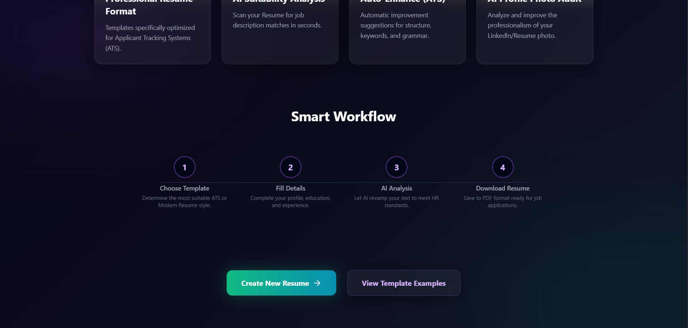
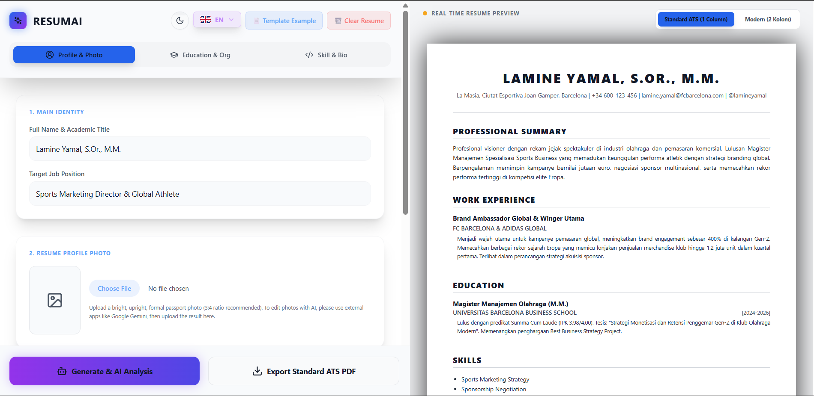
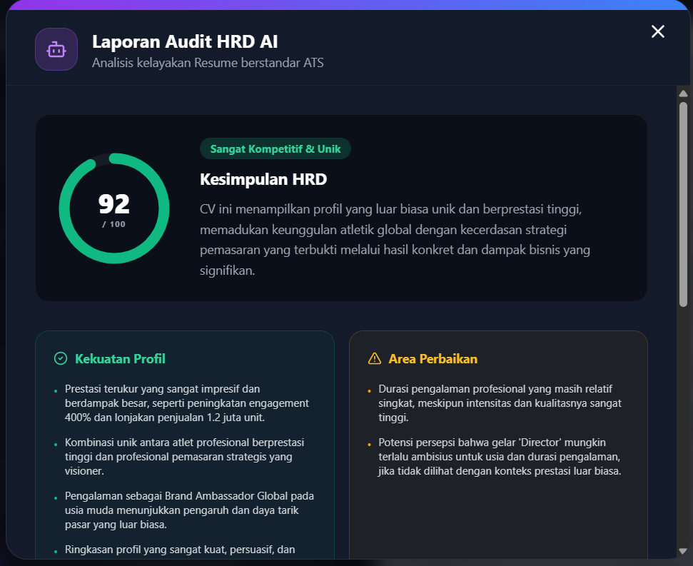
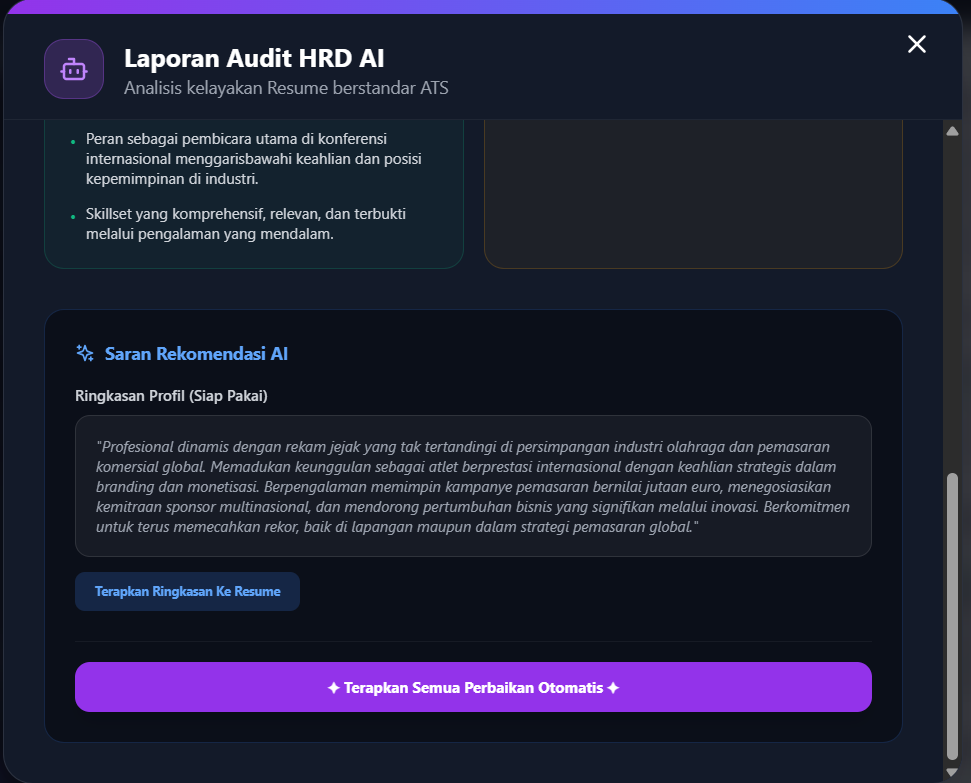

# RESUMAI - AI Resume & Photo Suitability Engine

> Tingkatkan Karier dengan Kekuatan AI | Boost Your Career with The Power of AI

RESUMAI is an intelligent resume builder application that leverages Google Gemini AI to analyze, improve, and optimize your resume for Applicant Tracking Systems (ATS). It supports two languages (English and Indonesian) and offers two stunning export templates (Standard ATS and Modern).

## 🌟 Screenshots

### Landing Page



### App Interface & CV Builder



### AI Features
**AI CV Review & Scoring**


**AI Recommendations**


## 🌟 Key Features

- **Smart Workflow**: Step-by-step guidance from choosing templates, filling data, AI analysis, to downloading your final PDF.
- **Bilingual Support**: Fully localized in English and Indonesian, including AI prompts and UI.
- **AI Suitability Analysis**: Gemini AI scores your CV, highlights strengths/weaknesses, and suggests a ready-to-use professional summary and skills.
- **AI Auto-Enhance**: Improve your raw experience and education descriptions into professional, metric-oriented, and active-verb sentences.
- **AI Profile Photo Audit**: Get an AI evaluation of your profile photo based on lighting, attire, expression, and corporate suitability.
- **Multiple Export Templates**:
  - **ATS Standard**: Minimalist, clean, and perfectly parsable by automated HR systems.
  - **Modern**: Beautifully designed with dark/light mode accents, perfect for creative and modern roles.


## 🛠️ Tech Stack
- **Frontend**: Next.js, React, Tailwind CSS, Lucide Icons, html2canvas, jsPDF, SweetAlert2
- **Backend**: Express.js, Multer, Google Generative AI (Gemini 2.5 Flash)
- **Styling**: Tailwind CSS (with Dark Mode / Light Mode toggle)

## 🚀 Getting Started

### Prerequisites
- Node.js (v18.17.0 or higher is strictly required for the Next.js frontend)
- npm or yarn
- Google Gemini API Key

### 1. Clone the repository
```bash
git clone https://github.com/0xriyans/resumai.git
cd resumai
```

### 2. Setup Backend
```bash
cd backend
npm install
```
Create a `.env` file in the `backend` folder:
```env
PORT=5000
GEMINI_API_KEY=your_gemini_api_key_here
```
Start the backend server:
```bash
node server.js
# or use nodemon: npx nodemon server.js
```
*The backend will run on http://localhost:5000*

### 3. Setup Frontend
Open a new terminal and go to the frontend directory:
```bash
cd frontend
npm install
```
Start the Next.js development server:
```bash
npm run dev
```
*The frontend will run on http://localhost:3000*

## 📝 License
This project is open-source and available under the MIT License.
